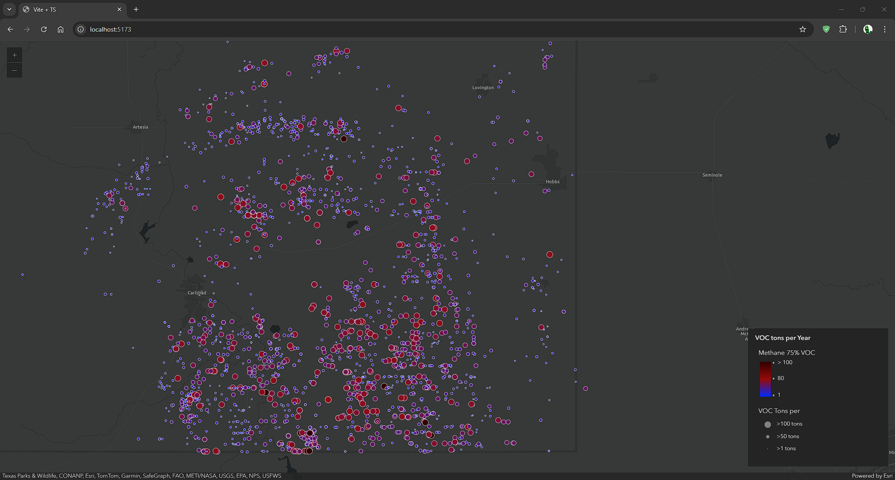

# Methane Data Display
A simple webapp displaying data on methane permits. I made this to get a handle on displaying arbitrary data with the ArcGis javascript sdk

## Running locally
After cloning the repository run

``npm install``

``npm run copy:all`` the webapp uses local assets instead of those provided by the ESRI CDN so they must be added to the assets folder

``npm run dev``